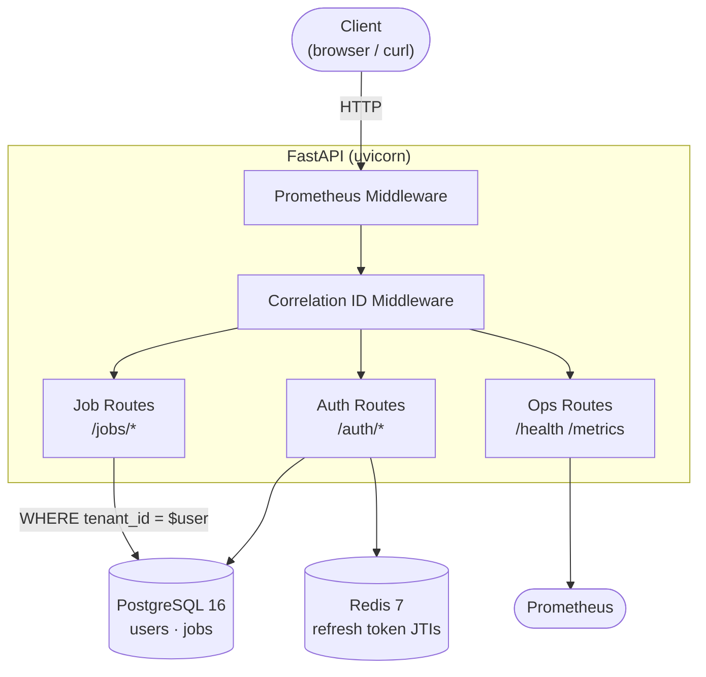
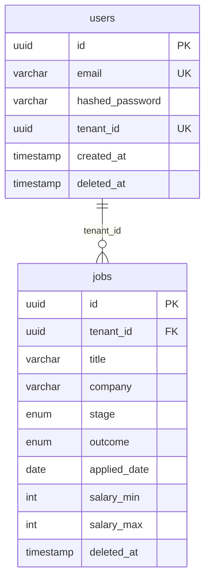

# P1 JobTrack Core — Design Document

## Overview

Multi-tenant REST API for tracking job applications through a hiring pipeline.
Serves as the backend for the AI Job Tracker portfolio (P1 of 6).

**Stack:** FastAPI · PostgreSQL 16 · Redis 7 · SQLAlchemy async · Alembic · Prometheus

---

## Cloud Provider Equivalents

| Component | Current (local) | AWS | Azure | GCP | Open Source |
|-----------|----------------|-----|-------|-----|-------------|
| **API runtime** | Docker + uvicorn | ECS Fargate / Lambda | Container Apps / App Service | Cloud Run / GKE | Kubernetes + Docker |
| **PostgreSQL** | Postgres 16 (Docker) | RDS for PostgreSQL | Azure Database for PostgreSQL | Cloud SQL (PostgreSQL) | PostgreSQL on VM / CockroachDB |
| **Redis** | Redis 7 (Docker) | ElastiCache for Redis | Azure Cache for Redis | Memorystore (Redis) | Redis on VM / Valkey |
| **Metrics scraping** | Prometheus (self-hosted) | Amazon Managed Prometheus | Azure Monitor | Cloud Monitoring | Prometheus + Grafana |
| **Structured logs** | structlog → stdout | CloudWatch Logs | Azure Monitor Logs | Cloud Logging | ELK Stack / Loki + Grafana |
| **Secrets / env vars** | `.env` file | Secrets Manager / Parameter Store | Key Vault | Secret Manager | HashiCorp Vault |
| **Database migrations** | Alembic (manual) | Same — run in ECS task on deploy | Same — run as init container | Same — run as Cloud Run job | Same |
| **Container registry** | Local Docker daemon | ECR | Azure Container Registry | Artifact Registry | Docker Hub / Harbor |

---

## Architecture

See architecture diagram: [draw.io source](docs/architecture.drawio) · [diagram image](docs/p1-architecture-draw-io-pic.jpg)



---

## Data Model

### ID strategy: UUID v4

All primary keys are UUID v4. Sequential integer IDs are enumerable — an
authenticated user knowing `/jobs/42` can infer `/jobs/43` exists. UUIDs
carry no ordinality and reveal nothing about neighbouring records.

### Pipeline: two-field model

```
stage   ∈ { wishlist, applied, phone_screen, onsite, offer }
outcome ∈ { active, frozen, rejected, withdrawn, accepted }
```

A single flat status enum (`applied_rejected`, `onsite_frozen`, …) requires
O(stages × outcomes) values and cannot express "frozen — but at which stage?"
without additional fields. The two-field model captures the full 5×5 state
matrix cleanly and makes filtered queries explicit:

```sql
-- all active interviews
WHERE stage IN ('phone_screen','onsite') AND outcome = 'active'
```

### Soft deletes

Rows are never hard-deleted. `deleted_at` is set on deletion; all queries
filter `WHERE deleted_at IS NULL`. Enables recovery, audit history, and future
trash/undo features without schema changes.

### `applied_date` as `DATE` not `TIMESTAMP`

An application date is a calendar date, not a moment in time. `TIMESTAMP`
introduces timezone ambiguity. `DATE` stores exactly what the user means.

### Entity-relationship



---

## Auth Design

### Token architecture

| Token | Lifetime | Storage | Verified by |
|-------|----------|---------|-------------|
| Access (JWT) | 15 min | Client only | Crypto signature — no DB lookup |
| Refresh (JWT) | 7 days | Client + Redis JTI set | Signature + Redis presence |

Access tokens are stateless — any instance verifies them with the `SECRET_KEY`
without shared state. This keeps the hot path (every authenticated request)
at zero extra I/O.

Refresh tokens are stateful via their JTI (JWT ID) stored in Redis. On each
refresh, the old JTI is deleted and a new pair issued (token rotation). This
enables two properties pure JWTs cannot provide:

- **Logout invalidation** — delete JTI, token is immediately dead despite not expiring
- **Stolen token detection** — reuse of a rotated token returns 401; the legitimate
  user's next refresh will also fail, signalling compromise

### Password hashing

`bcrypt` used directly. `passlib 1.7.4` has a known incompatibility with
`bcrypt ≥ 4.0` that raises deprecation warnings and will break in future
releases. Direct usage removes the intermediate dependency.

### Login error response

Both wrong-password and unknown-email return `401 Invalid email or password`.
Returning `404` for unknown emails enables user enumeration — an attacker
could determine which emails have accounts on the platform.

---

## Pagination

Cursor-based, encoding `(applied_date, id)` as opaque base64 JSON.

**Why not offset/limit:** `LIMIT n OFFSET k` is unstable under concurrent
inserts — a new record inserted between page 1 and page 2 being fetched
causes a boundary record to be repeated or skipped. Cursor pagination is
positionally stable regardless of concurrent writes.

**Cursor encoding:**
```python
{"d": "2026-05-20", "i": "uuid"}  →  base64url  →  opaque string
```

The opaque cursor lets the sort key change in future versions without
breaking client integrations (clients treat it as a black box).

**Trade-off:** no random page access. Acceptable for a record set in the
tens-to-hundreds range where sequential scrolling is the primary access pattern.

---

## Observability

### Structured logging

All logs emitted as JSON via `structlog`. Every request log line includes:
`correlation_id`, `method`, `path`, `status_code`, `duration_ms`.

Correlation IDs are read from the `X-Correlation-ID` request header (or
generated fresh) and returned in the response header, enabling end-to-end
tracing across services.

### Prometheus metrics

| Metric | Type | Labels |
|--------|------|--------|
| `http_requests_total` | Counter | method, path, status_code |
| `http_request_duration_seconds` | Histogram | method, path |
| `http_requests_inprogress` | Gauge | method, path |

Ops paths (`/metrics`, `/health`, `/docs`) excluded from instrumentation.

---

## Testing Strategy

| Concern | Approach | Rationale |
|---------|----------|-----------|
| Database | Real Postgres 16 | SQLite lacks UUID types, asyncpg parameter syntax, and partial indexes |
| Connection pool | `NullPool` | Prevents asyncpg "operation in progress" errors from pool reuse across concurrent fixtures |
| Redis | `fakeredis.FakeAsyncRedis` | In-process, zero network overhead, flushed between tests |
| HTTP | `httpx.AsyncClient` + `ASGITransport` | Full FastAPI stack without binding a port |
| Isolation | `autouse` `clean_tables` fixture | Deletes rows (jobs → users, FK order) after every test |
