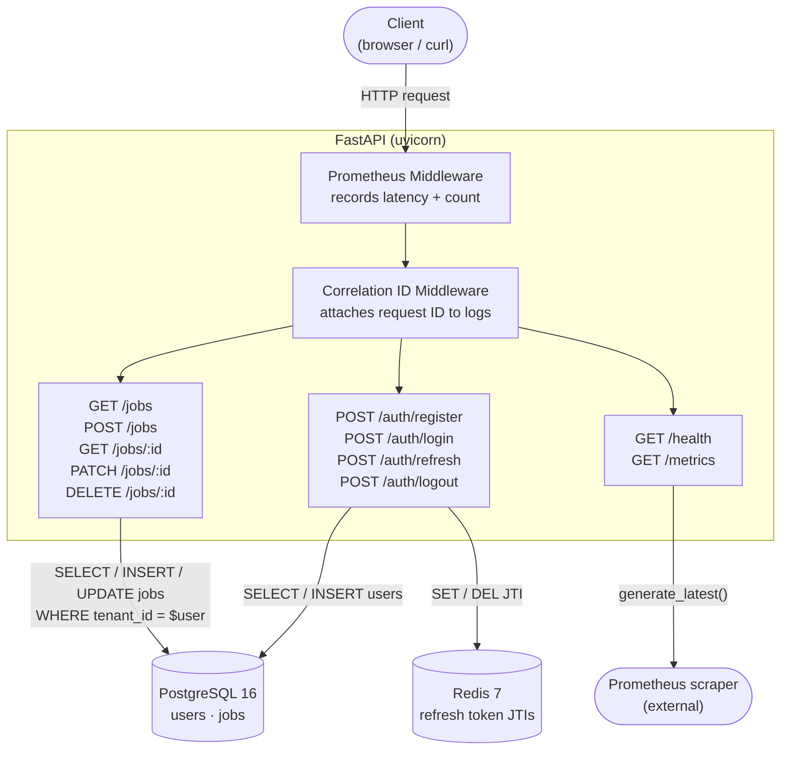
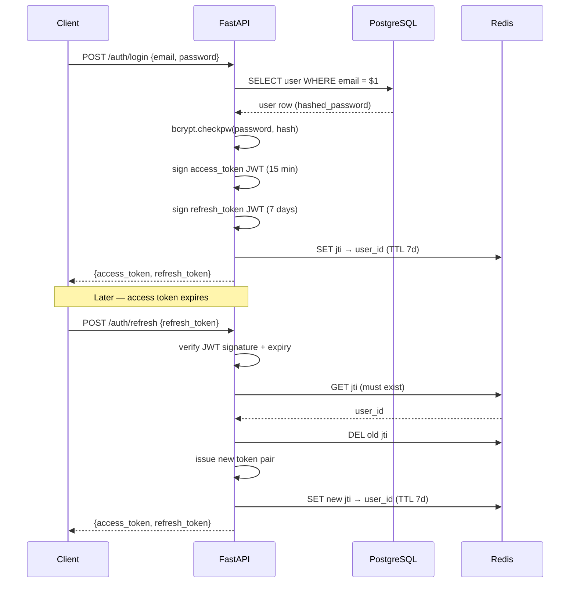

# P1 — JobTrack Core API

A production-grade REST API for tracking job applications through a hiring pipeline.
Built with FastAPI, PostgreSQL, and Redis. Part of the [AI Job Tracker](../README.md) portfolio.

**Key features:** JWT auth with refresh token rotation · Multi-tenant row isolation ·
Two-field pipeline model (stage × outcome) · Cursor-based pagination · Prometheus metrics ·
Structured JSON logging · 23-test async test suite

---

## Architecture



---

## Request flow (auth example)



---

## Project structure

```
P1-JobTrack-Core/
├── app/
│   ├── auth/           # register, login, refresh, logout routes + JWT service
│   ├── models/         # SQLAlchemy ORM models (User, Job) + base mixins
│   ├── routers/        # Job CRUD routes
│   ├── schemas/        # Pydantic request/response schemas
│   ├── services/       # Business logic (job CRUD, cursor pagination)
│   ├── config.py       # Settings loaded from .env via pydantic-settings
│   ├── dependencies.py # FastAPI Depends factories (get_db, get_redis, get_current_user)
│   ├── main.py         # App factory, middleware, /health + /metrics
│   └── metrics.py      # Prometheus metric definitions
├── alembic/            # Database migrations
├── tests/
│   ├── conftest.py     # Fixtures: engine (NullPool), db, fake_redis, client, auth helpers
│   ├── test_auth.py    # 9 auth tests
│   └── test_jobs.py    # 14 job tests (incl. tenant isolation + cursor pagination)
├── DESIGN.md           # Architecture decisions and trade-offs
├── docker-compose.yml  # App + Postgres 16 + Redis 7
├── Dockerfile
└── pyproject.toml
```

---

## Quick start

```bash
# 1. Copy environment file
cp .env.example .env          # edit SECRET_KEY before deploying

# 2. Start all services
make up

# 3. Run database migrations
make migrate

# 4. Verify the service
curl http://localhost:8000/health
# {"status":"ok","version":"0.1.0","environment":"development"}

# 5. Run the test suite
make test
```

---

## API endpoints

| Method | Path | Auth | Description |
|--------|------|------|-------------|
| POST | `/auth/register` | — | Create account, returns token pair |
| POST | `/auth/login` | — | Login, returns token pair |
| POST | `/auth/refresh` | — | Rotate refresh token |
| POST | `/auth/logout` | — | Revoke refresh token |
| GET | `/jobs` | ✓ | List jobs (cursor pagination, stage/outcome filter) |
| POST | `/jobs` | ✓ | Create job |
| GET | `/jobs/{id}` | ✓ | Get job by ID |
| PATCH | `/jobs/{id}` | ✓ | Partial update |
| DELETE | `/jobs/{id}` | ✓ | Soft delete |
| GET | `/health` | — | Liveness check |
| GET | `/metrics` | — | Prometheus metrics |

---

## Design decisions

See [DESIGN.md](./DESIGN.md) for detailed rationale on:
- Two-field pipeline model (stage × outcome) vs flat status enum
- Cursor-based pagination vs offset/limit
- Stateless access tokens + stateful refresh tokens
- Real Postgres in tests (not SQLite), NullPool, fakeredis
